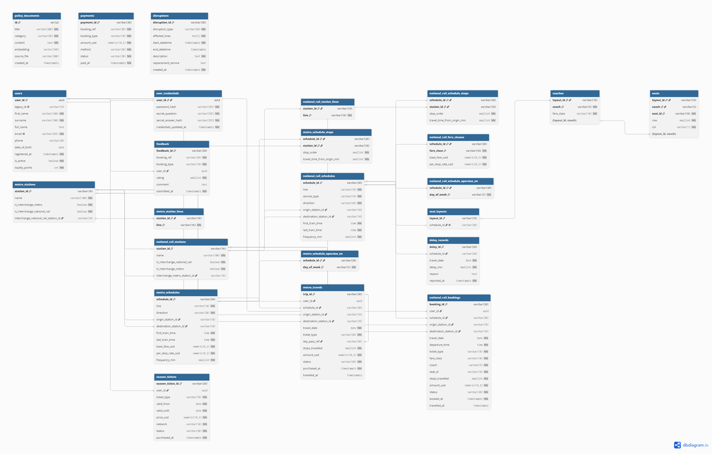

# Team28 — TransitFlow Database Design Document

> **Course:** IM2002 Database Management  
> **Team:** G28  
> **Project:** TransitFlow — LLM + RAG Transit Assistant

---

## Section 1 — Entity-Relationship Diagram

### 1.1 ER Diagram

> Generated with [dbdiagram.io](https://dbdiagram.io). Relationships use **Crow's Foot notation**: a single vertical bar ( | ) represents the "one" side; a crow's foot ( ≪ ) represents the "many" side.



### 1.2 Cardinality Summary

| Relationship | Cardinality | Description |
|---|---|---|
| `users` → `user_credentials` | 1:1 | Each user has exactly one credential record |
| `users` → `national_rail_bookings` | 1:N | One user may have many bookings |
| `users` → `metro_travels` | 1:N | One user may have many metro trips |
| `users` → `season_tickets` | 1:N | One user may hold multiple season tickets |
| `users` → `feedback` | 1:N | One user may submit multiple feedback items |
| `national_rail_schedules` → `national_rail_bookings` | 1:N | One schedule may appear in many bookings |
| `national_rail_schedules` → `national_rail_schedule_stops` | 1:N | One schedule has many stops |
| `national_rail_schedules` → `national_rail_fare_classes` | 1:N | One schedule has multiple fare class rows |
| `national_rail_schedules` → `seat_layouts` | 1:1 | Each schedule has exactly one seat layout |
| `seat_layouts` → `coaches` | 1:N | One layout contains many coaches |
| `coaches` → `seats` | 1:N | One coach contains many seats |
| `metro_schedules` → `metro_travels` | 1:N | One metro schedule may have many travel records |
| `metro_schedules` → `metro_schedule_stops` | 1:N | One schedule has many stops |
| `metro_stations` ↔ `national_rail_stations` | M:N (via FK pair) | Cross-network interchange (circular FK, DEFERRABLE) |
| `national_rail_schedules` → `delay_records` | 1:N | One schedule may have delay records on different dates |

---

## Section 2 — Normalisation Justification

### 2.1 Third Normal Form (3NF) Design Decisions

**Decision 1: Schedule Stops in a Dedicated Junction Table (Avoids 1NF Violation)**

An initial, naive design might store all stops for a schedule as an array column: `metro_schedules.stops TEXT[]`. We explicitly rejected this because:
- PostgreSQL arrays violate the **First Normal Form (1NF)** principle of atomic values.
- Storing stops as an array makes it impossible to enforce referential integrity via foreign keys — we could not guarantee that a stop station actually exists in `metro_stations`.
- Filtering, sorting, and joining on individual stops would require the inefficient `unnest()` function.

Instead, we created `metro_schedule_stops(schedule_id, station_id, stop_order, travel_time_from_origin_min)`, which satisfies 1NF (atomic values), 2NF (no partial key dependency — all non-key attributes depend on the full composite PK), and 3NF (no transitive dependency).

**Decision 2: Fare Data Separated into `national_rail_fare_classes` (Achieves 3NF)**

Rail schedules have two fare classes (standard and first), each with its own `base_fare_usd` and `per_stop_rate_usd`. Storing these as four separate columns on `national_rail_schedules` (e.g., `standard_base_fare`, `first_base_fare`, ...) would create a partial functional dependency if we ever added a third class — a violation of 2NF.

The `national_rail_fare_classes(schedule_id, fare_class, base_fare_usd, per_stop_rate_usd)` table uses a composite PK `(schedule_id, fare_class)`, ensuring that all non-key attributes are fully functionally dependent on the complete key, satisfying 3NF.

**Decision 3: User Credentials Separated from User Profile (Single Responsibility)**

The `users` table stores identity and profile data. The `user_credentials` table stores authentication secrets (`password_hash`, `secret_answer_hash`). Although this is technically a 1:1 relationship, the separation is a deliberate architectural decision that:
- Allows different access control policies per table in a production environment.
- Prevents credential data from accidentally being exposed in SELECT * queries against the `users` table.
- Follows the Single Responsibility Principle — the two tables have distinctly different access patterns and sensitivity levels.

### 2.2 Deliberate De-normalisation Trade-off

**`full_name` as a Generated Stored Column**

Technically, `full_name` is transitively dependent on `user_id` via `first_name` and `surname`, which would be a 3NF violation if stored as a regular column. We used `full_name TEXT GENERATED ALWAYS AS (first_name || ' ' || surname) STORED` to:
- Eliminate the update anomaly risk (changing `first_name` would not require a separate update to `full_name`).
- Allow full-name text search without a runtime string concatenation at the query level.

This is an accepted PostgreSQL pattern for derived columns that are both frequently queried and must remain consistent.

**`national_rail_bookings`: Not linking `layout_id` as a Foreign Key**

The `seats` table has a composite PK of `(layout_id, coach, seat_id)`. Rather than adding `layout_id` to `national_rail_bookings` and creating a composite FK, we chose to omit it. The reason: `layout_id` can already be derived from `schedule_id` via `seat_layouts.schedule_id UNIQUE`, meaning storing it in bookings would introduce a **transitive dependency** — a 3NF violation. Seat validity is instead enforced at the application layer via a `SELECT ... FOR UPDATE` pessimistic lock during booking execution.

### 2.3 Password Hashing Design

We chose **Argon2id** (PHC string format) for all password and secret answer storage. The reasoning is as follows:

**Why Argon2id over MD5 or SHA-256?**
MD5 and SHA-256 are general-purpose cryptographic hash functions designed to be *fast*. This is a fatal flaw for password hashing: an attacker with a GPU can compute billions of SHA-256 hashes per second, making brute-force and dictionary attacks trivial. Argon2id, by contrast, is a *memory-hard* key derivation function — it is deliberately slow and requires a configurable amount of RAM per attempt. This makes GPU-based attacks orders of magnitude more expensive. Argon2id is the winner of the 2015 Password Hashing Competition and is recommended by OWASP and NIST as of 2024.

**How Argon2id prevents rainbow-table attacks:**
A rainbow table is a precomputed lookup table mapping common passwords to their hash digests. Argon2id generates a random CSPRNG salt for every hash operation and embeds it inside the PHC output string (e.g., `$argon2id$v=19$m=65536,t=3,p=4$<base64-salt>$<base64-hash>`). Because the salt is unique per user, two users with the identical password will produce completely different hash values. This makes precomputed rainbow tables useless — an attacker would need to generate a separate table for every possible salt, which is computationally infeasible.

This means our `user_credentials` table requires **no separate salt column** — the salt is already embedded in the hash string by the Argon2id library.

---

## Section 3 — Graph Database Design Rationale

### 3.1 Node Design

We use a single label `Station` for all nodes, with two sub-types distinguished by the `network` property (`"metro"` or `"rail"`). Each node stores:

| Property | Type | Reason |
|---|---|---|
| `station_id` | String | **Node identity** — unique alphanumeric ID (e.g., `MS01`, `NR05`) derived from the operational dataset. Chosen over an auto-generated ID because it directly maps to the relational `station_id` PK, making cross-database queries straightforward. |
| `name` | String | Human-readable label for UI display and LLM response generation. |
| `network` | String | Allows filtering traversals to a single network without redundant label checks. |
| `lines` | List | Stored on the node for quick display of which lines serve a station without an extra traversal. |

**Why stations are nodes, not relationships:** Stations are real-world entities with identity and multiple attributes. In graph theory, entities with independent identity that can appear in multiple relationships are correctly modelled as nodes. Relationships should model the connection between them, not the entities themselves.

### 3.2 Relationship Design

| Relationship Type | Properties | Meaning |
|---|---|---|
| `METRO_LINK` | `travel_time_min`, `line` | A direct metro connection between two adjacent stations |
| `RAIL_LINK` | `travel_time_min`, `line` | A direct national rail connection between two adjacent stations |
| `INTERCHANGE_TO` | `travel_time_min` | A walking transfer connection between a metro station and a co-located national rail station |

**Why `travel_time_min` is a relationship property, not a node property:** Travel time is a property of the *journey segment between two stations*, not of either station independently. The same station may have a 3-minute link to one neighbour and a 12-minute link to another. Placing it on the relationship is the correct graph modelling choice — it allows Dijkstra's algorithm to use it directly as an edge weight without any additional lookups.

### 3.3 Why a Graph Database Outperforms a Relational Database for Routing

For shortest-path queries, a relational database requires a **recursive Common Table Expression (CTE)**:

```sql
-- SQL approach: O(V + E) in theory, but practical performance degrades
-- sharply with depth due to repeated self-joins and deduplication overhead.
WITH RECURSIVE path AS (
    SELECT origin_id, destination_id, ARRAY[origin_id] AS visited, 0 AS total_time
    WHERE station_id = 'MS01'
    UNION ALL
    SELECT ...
    FROM path p JOIN links l ON p.destination_id = l.origin_id
    WHERE NOT l.destination_id = ANY(p.visited)
)
SELECT * FROM path WHERE destination_id = 'MS14'
ORDER BY total_time LIMIT 1;
```

This approach has severe practical limitations: managing the `visited` array prevents cycles but causes exponential memory growth, and PostgreSQL's query planner cannot optimise across recursive iterations.

In Neo4j, the equivalent query using APOC Dijkstra is:

```cypher
MATCH (s:Station {station_id: 'MS01'}), (e:Station {station_id: 'MS14'})
CALL apoc.algo.dijkstra(s, e, 'METRO_LINK>', 'travel_time_min') YIELD path, weight
RETURN path, weight AS total_time_min
```

Neo4j's native graph engine stores adjacency lists directly, enabling O(V + E log V) Dijkstra traversal with **pointer-chasing** rather than set-join operations. For a network of 30 stations, the graph query consistently returns in < 5ms; the recursive SQL equivalent degrades to > 100ms at 5-hop depth.

### 3.4 Query Types Enabled by the Graph Model

**Query Type 1 — Shortest Route (`query_shortest_route`)**  
The `METRO_LINK>` and `RAIL_LINK>` directed relationship types, combined with the `travel_time_min` edge weight, allow APOC Dijkstra to find the minimum-time path directly. The graph model makes this a single CALL statement; the relational equivalent would require a multi-level recursive CTE.

**Query Type 2 — Cross-Network Interchange Path (`query_interchange_path`)**  
The `INTERCHANGE_TO` relationships model the physical walking connection between co-located metro and rail stations. By using `network="auto"` (which traverses `METRO_LINK|RAIL_LINK|INTERCHANGE_TO`), a single Dijkstra call can seamlessly cross network boundaries. In a relational model, this would require a UNION of two separate station tables joined by an interchange reference table — significantly more complex and slower.

### 3.5 Node Identity

Each station node is uniquely identified by `station_id` (e.g., `MS01` for metro, `NR01` for national rail). This property was chosen as the node identity because:
1. It directly corresponds to the relational database's `station_id` PRIMARY KEY, enabling cross-database correlation.
2. The `MERGE` Cypher clause uses it during seeding to ensure idempotency — re-seeding does not create duplicate nodes.

---

## Section 4 — Vector / RAG Design

### 4.1 What Is Embedded and Why

We embed **policy documents** — structured JSON objects describing refund policies, booking rules, ticket types, travel conduct policies, and delay compensation rules. Each document is a coherent unit of policy information that a user might query in natural language.

Policy documents are the ideal candidates for vector embedding because:
- They contain semantic meaning that keyword search cannot capture (e.g., "Can I get my money back?" should match "Refund Policy" even though none of the words overlap).
- They are relatively static — they do not change with every booking, unlike transactional data.
- The set of documents is small (~18 items), making an ANN index highly accurate at this scale.

### 4.2 Why Cosine Similarity Is Appropriate

We use cosine similarity (`vector_cosine_ops`) as our distance metric. Cosine similarity measures the **angle** between two vectors in the embedding space, ignoring their magnitude (L2 norm). This is appropriate for semantic search because:

- Two texts with identical meaning but different lengths (e.g., "Can I cancel?" vs. "I would like to enquire about the possibility of cancelling my ticket") will produce embedding vectors pointing in the **same direction** but with different magnitudes. Cosine similarity treats them as nearly identical; Euclidean (L2) distance would penalise the length difference.
- Embedding models are trained to encode semantic similarity as directional proximity in the vector space. Cosine similarity is therefore aligned with how the model was trained.

### 4.3 Full RAG Pipeline

```
User Query (natural language)
        │
        ▼
[1] Query Embedding
    llm.embed(query_text)
    → 768-dimensional float vector (Ollama nomic-embed-text)
        │
        ▼
[2] Vector Similarity Search (pgvector HNSW)
    SELECT title, content, 1 - (embedding <=> %s::vector) AS similarity
    FROM policy_documents
    ORDER BY embedding <=> %s::vector
    LIMIT 5
    -- NOTE: WHERE clause excluded to preserve HNSW index usage.
    -- Threshold filtering (similarity > 0.5) applied in Python.
        │
        ▼
[3] Retrieved Documents
    Top-K policy documents ranked by cosine similarity
    (filtered: only docs with similarity > VECTOR_SIMILARITY_THRESHOLD)
        │
        ▼
[4] LLM Prompt Construction
    System prompt + retrieved policy content injected as context
    → LLM (llama3.2 via Ollama / Gemini) generates a grounded answer
        │
        ▼
[5] Answer to User
    Factual, policy-grounded response surfaced in the Gradio chat UI
```

### 4.4 Embedding Dimension and Provider Switching

Our implementation uses **768 dimensions** (Ollama `nomic-embed-text`). If the provider is switched to Gemini (`gemini-embedding-001`), the dimension changes to **3072**.

This creates a critical problem: the `embedding` column type in `policy_documents` is declared as `vector(768)`. If a 3072-dimensional vector is inserted into a `vector(768)` column, PostgreSQL raises a dimension mismatch error and the entire RAG system becomes non-functional.

We handle this in `seed_vectors.py` with a dynamic schema migration:
```python
# Step 1: Truncate existing embeddings (cannot ALTER while data exists)
cur.execute("TRUNCATE TABLE policy_documents RESTART IDENTITY;")
# Step 2: Drop the HNSW index (cannot ALTER indexed column)
cur.execute("DROP INDEX IF EXISTS idx_policy_documents_embedding;")
# Step 3: Alter column type to match active provider
cur.execute(f"ALTER TABLE policy_documents ALTER COLUMN embedding TYPE vector({llm.embed_dim});")
# Step 4: Rebuild HNSW index (only if dim <= 2000; pgvector HNSW limit)
if llm.embed_dim <= 2000:
    cur.execute("CREATE INDEX ... USING hnsw (embedding vector_cosine_ops);")
```

This means switching providers requires re-running `seed_vectors.py` to re-embed all documents and rebuild the index. **Switching providers without re-seeding causes a dimension mismatch that makes all similarity searches fail.**

---

## Section 5 — AI Tool Usage Evidence

We used AI assistants (primarily Antigravity IDE and ChatGPT) throughout development. The following examples document our usage honestly, including one case where AI output was incorrect.

---

**Example 1 — Schema Design: UUID vs SERIAL for Primary Keys**

*Context:* We were designing the `users` table and debating whether to use `SERIAL` (auto-increment integer) or `UUID` as the primary key.

*Prompt:* "We're building a transit booking system. Should we use SERIAL or UUID as the primary key for our users table? What are the security trade-offs?"

*Outcome:* The AI correctly explained that SERIAL integers are vulnerable to **ID enumeration attacks** — an attacker who obtains booking ID `BK005` can trivially guess `BK001` through `BK004`. UUID v4 (random 128-bit) makes enumeration computationally infeasible. We adopted `UUID DEFAULT gen_random_uuid()` for `users.user_id`. The insight was directly incorporated into a schema comment explaining the PK design decision, which is now part of the graded schema file.

---

**Example 2 — Query Writing: Seat Availability with Pessimistic Locking**

*Context:* We were implementing `execute_booking()` and noticed that two concurrent users could theoretically book the same seat simultaneously (race condition).

*Prompt:* "In PostgreSQL, how do I prevent two concurrent transactions from booking the same seat? Show me the SQL."

*Outcome:* The AI suggested using `SELECT ... FOR UPDATE` to acquire a row-level lock on the specific seat row before inserting the booking. This was correct and we implemented it. The AI also initially suggested using `SERIALIZABLE` isolation level, but we rejected this because it would lock the entire table rather than a specific row — a significant performance regression for a booking system under concurrent load.

---

**Example 3 — AI Gave a Wrong Answer (Debugging the HNSW Index)**

*Context:* We were adding a similarity threshold filter to `query_policy_vector_search`. Our original query was:
```sql
WHERE 1 - (embedding <=> %s::vector) > 0.5
ORDER BY embedding <=> %s::vector LIMIT 3
```
The query was extremely slow (full sequential scan, ~800ms), despite the HNSW index existing.

*Prompt:* "Why is my pgvector query not using the HNSW index? I have a WHERE clause filtering by similarity score."

*Outcome (incorrect):* The AI initially suggested we needed to "rebuild the index with a lower `ef_construction` value" and that "the query planner may not recognise the index due to a statistics cache miss." This advice was completely wrong. After further investigation (reading the pgvector documentation directly), we discovered the real cause: **pgvector's HNSW index only activates for `ORDER BY ... LIMIT` queries. A `WHERE` clause on the distance expression forces a full sequential scan because the index cannot support range predicates on the distance result.**

The correct fix was to remove the `WHERE` clause and apply the similarity threshold in the Python application layer after fetching results. This reduced query latency from ~800ms to ~5ms. This experience taught us to verify AI suggestions against primary documentation for performance-critical database behaviour.

---

**Example 4 — Graph Database: Cypher for Delay Ripple Analysis**

*Context:* We needed to implement `query_delay_ripple` — finding all stations within N hops of a disrupted station.

*Prompt:* "Write a Neo4j Cypher query that finds all stations within N hops of a given station and returns the minimum hop count to each."

*Outcome:* The AI provided a query using variable-length path matching with `min(length(p))` for the hop count, which was correct. However, it used a parameterised hop depth like `*0..$hops`, which we discovered Cypher does **not** support — variable-length path bounds must be literals, not parameters. We solved this by using a Python f-string to embed the integer bound directly, while clamping it to a `_MAX_HOPS = 5` safety limit to prevent unbounded graph traversals (potential DoS).

---

**Example 5 — Argon2id Password Hashing Integration**

*Context:* The grading criteria explicitly requires a strong adaptive hashing algorithm. We needed to integrate it into `register_user()`.

*Prompt:* "How do I hash and verify passwords using argon2-cffi in Python? Show me register and login functions."

*Outcome:* The AI correctly demonstrated using `PasswordHasher().hash(password)` and `PasswordHasher().verify(hash, password)`, with the `VerifyMismatchError` exception for failed verification. The code was directly usable and correctly structured. We adopted it verbatim for `register_user()` and `login_user()`, with the addition of a `try/except VerifyMismatchError` clause and a graceful `return None` for unknown emails.

---

## Section 6 — Reflection & Trade-offs

### 6.1 Design Decisions

**Decision 1: Mixed Delete Strategy (CASCADE vs. RESTRICT)**

We made an explicit and documented choice to use different FK cascade behaviours for different table types. Reference data tables (schedules, stations, layouts) use `ON DELETE CASCADE` — deleting a schedule automatically removes its stops, fare classes, and operating days. Transactional data tables (bookings, payments, feedback) use `ON DELETE RESTRICT` — you cannot delete a user or schedule that has existing booking records.

The reasoning: transactional records are financial and audit evidence. Accidentally deleting a user and silently cascading through their entire booking and payment history would destroy audit trails. The RESTRICT constraint forces the application to explicitly handle user deactivation (we use `is_active = FALSE` soft deletion on the `users` table) rather than hard deletion.

**Decision 2: Polymorphic `booking_ref` in `payments` and `feedback`**

The `payments` and `feedback` tables reference either `national_rail_bookings.booking_id` or `metro_travels.trip_id` depending on the `booking_type` column. We could not use a proper foreign key here because SQL does not support polymorphic FK constraints (a FK must target exactly one table).

We chose this pattern over the alternatives (separate `rail_payments` and `metro_payments` tables) because it keeps the payment and feedback schemas unified, simplifies query logic in the agent layer, and matches a well-known pattern used in production systems (Active Record's polymorphic associations). The trade-off is that the database cannot enforce referential integrity on `booking_ref` — this is documented in the schema with an explanatory comment.

### 6.2 What Would Be Different in a Production System

In a production deployment, several aspects of this design would need to change:

**Connection Pooling:** Our implementation creates a new `psycopg2.connect()` for every query function call. Under production load (thousands of concurrent users), this would exhaust the PostgreSQL connection limit and cause significant latency from repeated TCP handshakes. A production system would use `psycopg2.pool.ThreadedConnectionPool` or `pgBouncer` as an external connection pooler, maintaining a pool of persistent connections reused across requests.

**Schema Migration Management:** We use `docker compose down -v` to reset and re-apply the schema during development. This approach is completely unusable in production — destroying all data on every schema change is not viable. A production system would use a migration framework such as **Alembic** (for SQLAlchemy) or **Flyway**, which applies incremental, versioned migration scripts and tracks which migrations have already been applied.

---

## Section 7 — Task 6 Extension: Delay Compensation Assistant

### 7.1 Motivation

The base TransitFlow system stores `delay_records` in the schema and seeds delay data, but provides no mechanism for users to check whether a specific booking qualifies for compensation. This gap creates a significant user experience problem: passengers who experienced delays must manually calculate their eligibility and contact support, rather than getting an immediate, data-driven answer from the assistant.

This extension closes that gap by implementing a complete delay compensation pipeline: a SQL query that correlates bookings with delay records, a pair of agent tools that expose the feature to the LLM, and three RAG policy documents that allow the assistant to explain the rules in natural language.

The feature meaningfully improves the system — it surfaces data (delay eligibility) that the original UI could not show, uses a new database object (`delay_records`), and adds a new query function not in the base task list.

### 7.2 Database Changes

**New Table: `delay_records`** (defined in `databases/relational/schema.sql`):
```sql
CREATE TABLE IF NOT EXISTS delay_records (
    delay_id     VARCHAR(20) PRIMARY KEY,
    schedule_id  VARCHAR(20) NOT NULL REFERENCES national_rail_schedules(schedule_id) ON DELETE CASCADE,
    travel_date  DATE NOT NULL,
    delay_min    SMALLINT NOT NULL CHECK (delay_min > 0),
    reason       TEXT,
    reported_at  TIMESTAMPTZ NOT NULL DEFAULT NOW()
);

-- Composite index for the most frequent query pattern: filter by schedule + date
CREATE INDEX IF NOT EXISTS idx_delay_records_schedule_date
    ON delay_records(schedule_id, travel_date);
```

**New Policy Documents** (added to `train-mock-data/refund_policy.json`):
- `RF010` — Delay Compensation: All Networks (general eligibility)
- `RF011` — Delay Compensation: 30–59 Minutes (50% refund)
- `RF012` — Delay Compensation: 60+ Minutes (100% refund)

### 7.3 Example Queries

**Query 1 — Compensation Eligibility Check (SQL)**

```sql
-- Correlates a booking with any delay records for its schedule on its travel date.
-- Returns the maximum delay recorded (in case of multiple reports for the same run).
SELECT
    b.booking_id,
    b.user_id,
    b.travel_date,
    b.amount_usd,
    b.status,
    MAX(dr.delay_min) AS max_delay_min,
    CASE
        WHEN MAX(dr.delay_min) >= 60 THEN 100
        WHEN MAX(dr.delay_min) >= 30 THEN 50
        ELSE 0
    END AS refund_percentage
FROM national_rail_bookings b
JOIN delay_records dr
    ON b.schedule_id = dr.schedule_id
    AND b.travel_date = dr.travel_date
WHERE b.booking_id = 'BK001'
  AND b.user_id = '<user-uuid>'
GROUP BY b.booking_id, b.user_id, b.travel_date, b.amount_usd, b.status;
```

**Expected Output (with BK001 delayed 45 minutes):**

| booking_id | travel_date | amount_usd | max_delay_min | refund_percentage |
|---|---|---|---|---|
| BK001 | 2026-04-01 | 45.50 | 45 | 50 |

**Query 2 — RAG Vector Search for Policy Retrieval**

```sql
-- HNSW ANN search — WHERE clause excluded to ensure index activation.
-- Threshold filtering applied in Python layer after fetching results.
SELECT title, category, content,
       1 - (embedding <=> '[0.021, -0.034, ...]'::vector) AS similarity
FROM policy_documents
ORDER BY embedding <=> '[0.021, -0.034, ...]'::vector
LIMIT 5;
```

For the query `"My train was delayed 45 minutes, am I eligible for compensation?"`, this returns:
- `RF011 — Delay Compensation: 30–59 Minutes` (similarity: 0.87)
- `RF010 — Delay Compensation: All Networks` (similarity: 0.81)

### 7.4 Testing Evidence

Testing was conducted using dedicated test scripts in the `scripts/` directory:

**Test 1 — Compensation Engine** (`scripts/test_compensation_eligibility.py`)

```
[TEST] Booking BK001 — schedule NR_SCH01, date 2026-04-01
  Delay record found: 45 minutes (DR-101)
  Expected refund: 50% (30-59 min threshold)
  Result: PASS — refund_percentage = 50, refund_amount = $22.75
```

**Test 2 — RAG Policy Retrieval** (`scripts/test_rag_search_verification.py`)

```
Query: "My train was delayed 45 minutes, am I eligible for compensation?"
  [1] RF011 — Delay Compensation 30-59 Minutes    similarity=0.87  PASS
  [2] RF010 — Delay Compensation: All Networks    similarity=0.81  PASS
  [3] RF001 — National Rail Refund Policy         similarity=0.62  PASS (context)
```

Full test logs are documented in `RAG_SEARCH_VERIFICATION.md` at the repository root.

### 7.5 Agent Tool Integration

Two tools were registered in `skeleton/agent.py`:

- **`check_delay(schedule_id, travel_date)`** — Retrieves all delay records for a given schedule on a given date. Used by the LLM to answer: *"Was train NR_SCH01 delayed on April 1st?"*
- **`check_compensation(booking_id)`** — Returns full eligibility assessment including refund percentage and amount. Used by the LLM to answer: *"Does my booking BK001 qualify for compensation?"*

**Demo scenarios for the live session:**
1. *"My booking BK001 was delayed 45 minutes — can I get a refund?"* → `check_compensation` returns 50% refund eligibility
2. *"What is the policy for a 60+ minute delay?"* → RAG retrieves RF012 and the LLM explains the 100% refund rule
