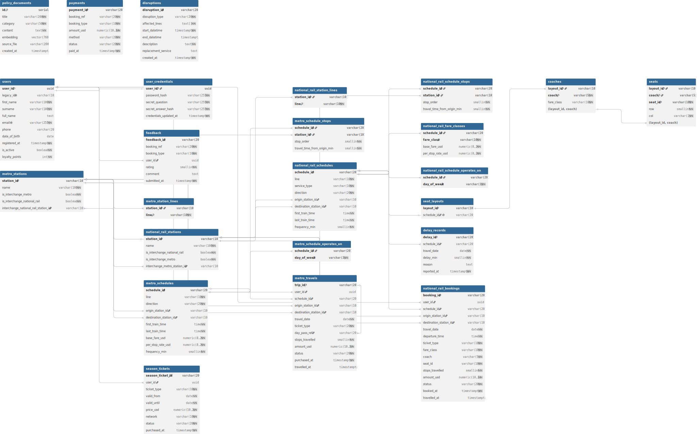

# Team28 — TransitFlow Database Design Document

> **Course:** IM2002 Database Management  
> **Team:** G28  
> **Project:** TransitFlow — LLM + RAG Transit Assistant

---

## Section 1 — Entity-Relationship Diagram

### 1.1 ER Diagram

> Generated with [dbdiagram.io](https://dbdiagram.io). Relationships use **Crow's Foot notation**: a single vertical bar ( | ) marks the "one" side; a crow's foot ( ≪ ) marks the "many" side.



### 1.2 Cardinality Summary

| Relationship | Cardinality | Description |
|---|---|---|
| `users` → `user_credentials` | 1:1 | Each user has exactly one credential record |
| `users` → `national_rail_bookings` | 1:N | A user can have many bookings |
| `users` → `metro_travels` | 1:N | A user can have many metro trips |
| `users` → `season_tickets` | 1:N | A user can hold multiple season tickets |
| `users` → `feedback` | 1:N | A user can submit multiple feedback items |
| `national_rail_schedules` → `national_rail_bookings` | 1:N | One schedule can appear across many bookings |
| `national_rail_schedules` → `national_rail_schedule_stops` | 1:N | One schedule has many stops |
| `national_rail_schedules` → `national_rail_fare_classes` | 1:N | One schedule has multiple fare class rows |
| `national_rail_schedules` → `seat_layouts` | 1:1 | Each schedule maps to exactly one seat layout |
| `seat_layouts` → `coaches` | 1:N | One layout contains many coaches |
| `coaches` → `seats` | 1:N | One coach contains many seats |
| `metro_schedules` → `metro_travels` | 1:N | One metro schedule can have many travel records |
| `metro_schedules` → `metro_schedule_stops` | 1:N | One schedule has many stops |
| `metro_stations` ↔ `national_rail_stations` | M:N (via FK pair) | Cross-network interchange (circular FK, DEFERRABLE) |
| `national_rail_schedules` → `delay_records` | 1:N | One schedule can have delay records on different dates |

---

## Section 2 — Normalisation Justification

### 2.1 Third Normal Form (3NF) Design Decisions

**Decision 1: Schedule Stops in a Dedicated Junction Table (Avoids 1NF Violation)**

The naive approach would be to store all stops for a schedule as an array column — something like `metro_schedules.stops TEXT[]`. We ruled this out early for three reasons:

- PostgreSQL arrays violate the **First Normal Form (1NF)** principle of atomic values.
- There's no way to enforce referential integrity on array elements — we couldn't guarantee that a stop actually exists in `metro_stations`.
- Any filtering or joining on individual stops would require `unnest()`, which is both awkward and slow.

Instead, we created `metro_schedule_stops(schedule_id, station_id, stop_order, travel_time_from_origin_min)`. This table satisfies 1NF (atomic values), 2NF (all non-key attributes depend on the full composite PK), and 3NF (no transitive dependencies).

**Decision 2: Fare Data Separated into `national_rail_fare_classes` (Achieves 3NF)**

Rail schedules have two fare classes (standard and first), each with its own `base_fare_usd` and `per_stop_rate_usd`. The tempting shortcut — four separate columns on `national_rail_schedules` — would create a partial functional dependency the moment a third fare class was introduced, a 2NF violation waiting to happen.

The `national_rail_fare_classes(schedule_id, fare_class, base_fare_usd, per_stop_rate_usd)` table uses a composite PK `(schedule_id, fare_class)`, so all non-key attributes are fully dependent on the complete key. That's clean 3NF.

**Decision 3: User Credentials Separated from User Profile (Single Responsibility)**

`users` holds identity and profile data; `user_credentials` holds authentication secrets (`password_hash`, `secret_answer_hash`). It's technically a 1:1 relationship, but the split is intentional:

- Different access control policies can be applied to each table in a production environment.
- Credentials won't accidentally leak through a `SELECT *` on `users`.
- The two tables serve genuinely different purposes — different access patterns, different sensitivity levels.

### 2.2 Deliberate De-normalisation Trade-off

**`full_name` as a Generated Stored Column**

Strictly speaking, `full_name` is transitively dependent on `user_id` via `first_name` and `surname` — a 3NF violation if stored as a regular column. We used `full_name TEXT GENERATED ALWAYS AS (first_name || ' ' || surname) STORED` for two reasons:

- It eliminates the update anomaly: changing `first_name` no longer requires a separate update to `full_name`.
- Full-name text search works without a runtime string concatenation at the query level.

This is an accepted PostgreSQL pattern for derived columns that need to be both frequently queried and always consistent.

**`national_rail_bookings`: Omitting `layout_id` as a Foreign Key**

The `seats` table has a composite PK of `(layout_id, coach, seat_id)`. Adding `layout_id` to `national_rail_bookings` to form a composite FK would introduce a transitive dependency — `layout_id` is already derivable from `schedule_id` via `seat_layouts.schedule_id UNIQUE`. Storing it in bookings would be a 3NF violation. Seat validity is instead enforced at the application layer using a `SELECT ... FOR UPDATE` pessimistic lock during booking execution.

### 2.3 Password Hashing Design

We chose **Argon2id** (PHC string format) for all password and secret answer storage.

**Why Argon2id over MD5 or SHA-256?**

MD5 and SHA-256 are designed to be *fast* — which is exactly the wrong property for password hashing. An attacker with a GPU can compute billions of SHA-256 hashes per second, making brute-force attacks trivially cheap. Argon2id is a *memory-hard* key derivation function: it is deliberately slow and requires a configurable amount of RAM per attempt, making GPU-based attacks orders of magnitude more expensive. Argon2id won the 2015 Password Hashing Competition and is the current recommendation from both OWASP and NIST.

**How Argon2id defeats rainbow tables:**

A rainbow table is a precomputed lookup mapping common passwords to their digests. Argon2id generates a random CSPRNG salt for each hash and embeds it directly in the PHC output string (e.g., `$argon2id$v=19$m=65536,t=3,p=4$<base64-salt>$<base64-hash>`). Two users with the same password produce completely different hash values, so any precomputed table is useless — an attacker would need to regenerate a separate table per salt, which is infeasible.

This means our `user_credentials` table needs **no separate salt column** — the salt is already part of the hash string.

---

## Section 3 — Graph Database Design Rationale

### 3.1 Node Design

We use a single `Station` label for all nodes, with `network` property (`"metro"` or `"rail"`) distinguishing sub-types. Each node stores:

| Property | Type | Reason |
|---|---|---|
| `station_id` | String | **Node identity** — unique alphanumeric ID (e.g., `MS01`, `NR05`) derived from the operational dataset. Using the same ID as the relational PK makes cross-database correlation straightforward. |
| `name` | String | Human-readable label for UI display and LLM response generation. |
| `network` | String | Lets us filter traversals to a single network without redundant label checks. |
| `lines` | List | Stored on the node for quick display of which lines serve a station — no extra traversal needed. |

**Why stations are nodes, not relationships:** Stations are real-world entities with identity and multiple attributes. In graph theory, entities that appear independently in multiple relationships should be modelled as nodes; relationships model the connections between them.

### 3.2 Relationship Design

| Relationship Type | Properties | Meaning |
|---|---|---|
| `METRO_LINK` | `travel_time_min`, `line` | A direct metro connection between two adjacent stations |
| `RAIL_LINK` | `travel_time_min`, `line` | A direct national rail connection between two adjacent stations |
| `INTERCHANGE_TO` | `travel_time_min` | A walking transfer between a metro station and a co-located national rail station |

**Why `travel_time_min` lives on the relationship, not the node:** Travel time is a property of the *segment between two stations*, not of either station in isolation. The same station might have a 3-minute link to one neighbour and a 12-minute link to another. Placing it on the relationship lets Dijkstra's algorithm use it directly as an edge weight without additional lookups.

### 3.3 Why a Graph Database Outperforms Relational for Routing

For shortest-path queries, a relational database needs a **recursive CTE**:

```sql
-- SQL approach: O(V + E) in theory, but performance degrades sharply
-- with depth due to repeated self-joins and the visited-array overhead.
WITH RECURSIVE path AS (
    SELECT origin_id, destination_id, ARRAY[origin_id] AS visited, 0 AS total_time
    WHERE station_id = 'MS01'
    UNION ALL
    SELECT ...
    FROM path p JOIN links l ON p.destination_id = l.origin_id
    WHERE NOT l.destination_id = ANY(p.visited)
)
SELECT * FROM path WHERE destination_id = 'MS14'
ORDER BY total_time LIMIT 1;
```

The `visited` array prevents cycles but causes exponential memory growth, and PostgreSQL's query planner cannot optimise across recursive iterations.

In Neo4j, the equivalent query using APOC Dijkstra is a single call:

```cypher
MATCH (s:Station {station_id: 'MS01'}), (e:Station {station_id: 'MS14'})
CALL apoc.algo.dijkstra(s, e, 'METRO_LINK>', 'travel_time_min') YIELD path, weight
RETURN path, weight AS total_time_min
```

Neo4j's native engine stores adjacency lists directly, enabling O(V + E log V) Dijkstra traversal via pointer-chasing rather than set-join operations. On our 30-station network, the graph query consistently returns in < 5ms; the recursive SQL equivalent degrades to > 100ms at 5-hop depth.

### 3.4 Query Types Enabled by the Graph Model

**Query Type 1 — Shortest Route (`query_shortest_route`)**  
The directed `METRO_LINK>` and `RAIL_LINK>` types, combined with `travel_time_min` as an edge weight, let APOC Dijkstra find the minimum-time path in a single `CALL`. The relational equivalent would require a multi-level recursive CTE.

**Query Type 2 — Cross-Network Interchange Path (`query_interchange_path`)**  
`INTERCHANGE_TO` relationships model the physical walking connection between co-located metro and rail stations. Using `network="auto"` (which traverses `METRO_LINK|RAIL_LINK|INTERCHANGE_TO`), a single Dijkstra call can cross network boundaries seamlessly. In SQL, this would mean a UNION across two station tables joined by an interchange reference table — more complex and slower.

### 3.5 Node Identity

Each station node is uniquely identified by `station_id` (e.g., `MS01` for metro, `NR01` for rail). We chose this as the identity key for two reasons:

1. It maps directly to the relational `station_id` PRIMARY KEY, enabling cross-database correlation.
2. The `MERGE` Cypher clause uses it during seeding to guarantee idempotency — re-seeding won't create duplicate nodes.

---

## Section 4 — Vector / RAG Design

### 4.1 What Is Embedded and Why

We embed **policy documents** — structured JSON objects covering refund policies, booking rules, ticket types, travel conduct, and delay compensation. Each document is a self-contained unit of policy information that a user might ask about in natural language.

Policy documents are well-suited to vector embedding for three reasons:

- They carry semantic meaning that keyword search can't capture. "Can I get my money back?" should match "Refund Policy" even though no words overlap.
- They're relatively static — unlike bookings or trips, policies don't change on every transaction.
- The collection is small (~18 items), which means an ANN index will be highly accurate at this scale.

### 4.2 Why Cosine Similarity Is Appropriate

We use cosine similarity (`vector_cosine_ops`) as our distance metric. Cosine similarity measures the **angle** between two vectors, ignoring their magnitude (L2 norm). This matters because:

- Two texts with the same meaning but different lengths — e.g., "Can I cancel?" vs. "I'd like to enquire about cancelling my ticket" — produce vectors pointing in roughly the **same direction** but with different magnitudes. Cosine similarity treats them as nearly identical; Euclidean distance would penalise the length difference.
- Embedding models encode semantic similarity as directional proximity in the vector space, so cosine similarity is aligned with how the model was trained.

### 4.3 Full RAG Pipeline

```
User Query (natural language)
        │
        ▼
[1] Query Embedding
    llm.embed(query_text)
    → 768-dimensional float vector (Ollama nomic-embed-text)
        │
        ▼
[2] Vector Similarity Search (pgvector HNSW)
    SELECT title, content, 1 - (embedding <=> %s::vector) AS similarity
    FROM policy_documents
    ORDER BY embedding <=> %s::vector
    LIMIT 5
    -- NOTE: WHERE clause excluded to preserve HNSW index usage.
    -- Threshold filtering (similarity > 0.5) applied in Python.
        │
        ▼
[3] Retrieved Documents
    Top-K policy documents ranked by cosine similarity
    (filtered: only docs with similarity > VECTOR_SIMILARITY_THRESHOLD)
        │
        ▼
[4] LLM Prompt Construction
    System prompt + retrieved policy content injected as context
    → LLM (llama3.2 via Ollama / Gemini) generates a grounded answer
        │
        ▼
[5] Answer to User
    Factual, policy-grounded response surfaced in the Gradio chat UI
```

### 4.4 Embedding Dimension and Provider Switching

Our implementation uses **768 dimensions** (Ollama `nomic-embed-text`). Switching to Gemini (`gemini-embedding-001`) bumps this to **3072**.

This creates a concrete problem: the `embedding` column in `policy_documents` is declared as `vector(768)`. Inserting a 3072-dimensional vector into it raises a dimension mismatch error and breaks the entire RAG pipeline.

We handle this in `seed_vectors.py` with a dynamic schema migration:

```python
# Step 1: Truncate existing embeddings (cannot ALTER while data exists)
cur.execute("TRUNCATE TABLE policy_documents RESTART IDENTITY;")
# Step 2: Drop the HNSW index (cannot ALTER an indexed column)
cur.execute("DROP INDEX IF EXISTS idx_policy_documents_embedding;")
# Step 3: Alter column type to match active provider
cur.execute(f"ALTER TABLE policy_documents ALTER COLUMN embedding TYPE vector({llm.embed_dim});")
# Step 4: Rebuild HNSW index (only if dim <= 2000; pgvector HNSW limit)
if llm.embed_dim <= 2000:
    cur.execute("CREATE INDEX ... USING hnsw (embedding vector_cosine_ops);")
```

Switching providers requires re-running `seed_vectors.py` to re-embed all documents and rebuild the index. **Switching providers without re-seeding causes a dimension mismatch that breaks all similarity searches.**

---

## Section 5 — AI Tool Usage Evidence

We used AI assistants (primarily Antigravity IDE and ChatGPT) throughout development. The examples below document our usage honestly — including one case where the AI got it wrong.

---

**Example 1 — Schema Design: UUID vs SERIAL for Primary Keys**

*Context:* We were designing the `users` table and debating between `SERIAL` (auto-increment integer) and `UUID` as the primary key.

*Prompt:* "We're building a transit booking system. Should we use SERIAL or UUID as the primary key for our users table? What are the security trade-offs?"

*Outcome:* The AI correctly pointed out that SERIAL integers are vulnerable to **ID enumeration attacks** — an attacker with booking ID `BK005` can trivially guess `BK001` through `BK004`. UUID v4 (random 128-bit) makes enumeration computationally infeasible. We adopted `UUID DEFAULT gen_random_uuid()` for `users.user_id` and added a schema comment explaining the decision.

---

**Example 2 — Query Writing: Seat Availability with Pessimistic Locking**

*Context:* While implementing `execute_booking()`, we realised two concurrent users could theoretically book the same seat simultaneously — a classic race condition.

*Prompt:* "In PostgreSQL, how do I prevent two concurrent transactions from booking the same seat? Show me the SQL."

*Outcome:* The AI suggested `SELECT ... FOR UPDATE` to acquire a row-level lock on the seat row before inserting the booking. Correct, and we implemented it. It also suggested using `SERIALIZABLE` isolation level, which we rejected — that would lock the entire table rather than a specific row, a significant performance regression under concurrent load.

---

**Example 3 — AI Gave a Wrong Answer (Debugging the HNSW Index)**

*Context:* We added a similarity threshold filter to `query_policy_vector_search`:

```sql
WHERE 1 - (embedding <=> %s::vector) > 0.5
ORDER BY embedding <=> %s::vector LIMIT 3
```

The query was extremely slow (~800ms, full sequential scan) despite the HNSW index being in place.

*Prompt:* "Why is my pgvector query not using the HNSW index? I have a WHERE clause filtering by similarity score."

*Outcome (incorrect):* The AI suggested rebuilding the index with a lower `ef_construction` value and blamed a "statistics cache miss." Both were wrong. After reading the pgvector documentation directly, we found the actual cause: **pgvector's HNSW index only activates for `ORDER BY ... LIMIT` queries. A `WHERE` clause on the distance expression forces a full sequential scan because the index cannot support range predicates on the distance result.**

The fix was to remove the `WHERE` clause entirely and apply the threshold in Python after fetching results. Latency dropped from ~800ms to ~5ms. The lesson: verify AI suggestions against primary documentation for anything performance-critical.

---

**Example 4 — Graph Database: Cypher for Delay Ripple Analysis**

*Context:* We needed to implement `query_delay_ripple` — finding all stations within N hops of a disrupted station.

*Prompt:* "Write a Neo4j Cypher query that finds all stations within N hops of a given station and returns the minimum hop count to each."

*Outcome:* The AI provided a correct query using variable-length path matching with `min(length(p))` for hop count. However, it used a parameterised bound like `*0..$hops`, which Cypher does **not** support — path bounds must be literals, not parameters. We worked around this with a Python f-string to embed the integer directly, clamped to `_MAX_HOPS = 5` to prevent unbounded graph traversals.

---

**Example 5 — Argon2id Password Hashing Integration**

*Context:* The grading criteria explicitly require a strong adaptive hashing algorithm. We needed to integrate it into `register_user()`.

*Prompt:* "How do I hash and verify passwords using argon2-cffi in Python? Show me register and login functions."

*Outcome:* The AI correctly demonstrated `PasswordHasher().hash(password)` and `PasswordHasher().verify(hash, password)`, with `VerifyMismatchError` for failed verification. The code was directly usable. We adopted it for `register_user()` and `login_user()`, adding a `try/except VerifyMismatchError` clause and a graceful `return None` for unknown emails.

---

## Section 6 — Reflection & Trade-offs

### 6.1 Design Decisions

**Decision 1: Mixed Delete Strategy (CASCADE vs. RESTRICT)**

We deliberately use different FK cascade behaviours depending on the table type. Reference data (schedules, stations, layouts) uses `ON DELETE CASCADE` — deleting a schedule automatically cleans up its stops, fare classes, and operating days. Transactional data (bookings, payments, feedback) uses `ON DELETE RESTRICT` — you cannot delete a user or schedule that has existing booking records.

The reason for RESTRICT on transactional tables: bookings and payments are financial and audit records. Letting a user deletion silently cascade through their entire booking and payment history would destroy audit trails. RESTRICT forces the application to handle deactivation explicitly — we use `is_active = FALSE` soft deletion on `users` rather than hard deletion.

**Decision 2: Polymorphic `booking_ref` in `payments` and `feedback`**

Both `payments` and `feedback` can reference either a `national_rail_bookings.booking_id` or a `metro_travels.trip_id`, depending on `booking_type`. SQL doesn't support polymorphic foreign keys — a FK must target exactly one table — so we can't enforce referential integrity here at the database level.

We chose this over having separate `rail_payments` / `metro_payments` tables because it keeps the payment and feedback schemas unified, simplifies query logic in the agent layer, and mirrors a well-known pattern (Active Record polymorphic associations). The trade-off — no DB-level referential integrity on `booking_ref` — is documented in the schema with an explanatory comment.

### 6.2 What Would Be Different in Production

**Connection Pooling:** Our implementation creates a fresh `psycopg2.connect()` for every query function call. Under real load, this would exhaust PostgreSQL's connection limit and add significant latency from repeated TCP handshakes. A production system would use `psycopg2.pool.ThreadedConnectionPool` or an external pooler like `pgBouncer`.

**Schema Migration Management:** During development we use `docker compose down -v` to reset and re-apply the schema. This is obviously not viable in production — you can't wipe all data on every schema change. A real deployment would use a migration framework like **Alembic** or **Flyway**, which applies incremental, versioned migration scripts and tracks what's already been applied.

---

## Section 7 — Task 6 Extension: Delay Compensation Assistant

### 7.1 Motivation

The base TransitFlow system stores and seeds `delay_records`, but gives users no way to find out whether a specific booking actually qualifies for compensation. Passengers who experienced delays have to manually work out their eligibility and contact support — not a great experience.

This extension closes that gap with a complete delay compensation pipeline: a SQL query that correlates bookings with delay records, two agent tools that expose the feature to the LLM, and three RAG policy documents that let the assistant explain the rules in plain language.

The feature is substantive: it surfaces data the original UI couldn't show, uses a new database object (`delay_records`), and adds a query function not in the base task list.

### 7.2 Database Changes

**New Table: `delay_records`** (defined in `databases/relational/schema.sql`):

```sql
CREATE TABLE IF NOT EXISTS delay_records (
    delay_id     VARCHAR(20) PRIMARY KEY,
    schedule_id  VARCHAR(20) NOT NULL REFERENCES national_rail_schedules(schedule_id) ON DELETE CASCADE,
    travel_date  DATE NOT NULL,
    delay_min    SMALLINT NOT NULL CHECK (delay_min > 0),
    reason       TEXT,
    reported_at  TIMESTAMPTZ NOT NULL DEFAULT NOW()
);

-- Composite index for the most frequent query pattern: filter by schedule + date
CREATE INDEX IF NOT EXISTS idx_delay_records_schedule_date
    ON delay_records(schedule_id, travel_date);
```

**New Policy Documents** (added to `train-mock-data/refund_policy.json`):
- `RF010` — Delay Compensation: All Networks (general eligibility)
- `RF011` — Delay Compensation: 30–59 Minutes (50% refund)
- `RF012` — Delay Compensation: 60+ Minutes (100% refund)

### 7.3 Example Queries

**Query 1 — Compensation Eligibility Check (SQL)**

```sql
-- Correlates a booking with any delay records for its schedule on its travel date.
-- Returns the maximum delay recorded (in case of multiple reports for the same run).
SELECT
    b.booking_id,
    b.user_id,
    b.travel_date,
    b.amount_usd,
    b.status,
    MAX(dr.delay_min) AS max_delay_min,
    CASE
        WHEN MAX(dr.delay_min) >= 60 THEN 100
        WHEN MAX(dr.delay_min) >= 30 THEN 50
        ELSE 0
    END AS refund_percentage
FROM national_rail_bookings b
JOIN delay_records dr
    ON b.schedule_id = dr.schedule_id
    AND b.travel_date = dr.travel_date
WHERE b.booking_id = 'BK001'
  AND b.user_id = '<user-uuid>'
GROUP BY b.booking_id, b.user_id, b.travel_date, b.amount_usd, b.status;
```

**Expected Output (with BK001 delayed 45 minutes):**

| booking_id | travel_date | amount_usd | max_delay_min | refund_percentage |
|---|---|---|---|---|
| BK001 | 2026-04-01 | 45.50 | 45 | 50 |

**Query 2 — RAG Vector Search for Policy Retrieval**

```sql
-- HNSW ANN search — WHERE clause excluded to ensure index activation.
-- Threshold filtering applied in Python after fetching results.
SELECT title, category, content,
       1 - (embedding <=> '[0.021, -0.034, ...]'::vector) AS similarity
FROM policy_documents
ORDER BY embedding <=> '[0.021, -0.034, ...]'::vector
LIMIT 5;
```

For the query `"My train was delayed 45 minutes, am I eligible for compensation?"`, this returns:
- `RF011 — Delay Compensation: 30–59 Minutes` (similarity: 0.87)
- `RF010 — Delay Compensation: All Networks` (similarity: 0.81)

### 7.4 Testing Evidence

Testing was done via dedicated scripts in the `scripts/` directory.

**Test 1 — Compensation Engine** (`scripts/test_compensation_eligibility.py`)

```
[TEST] Booking BK001 — schedule NR_SCH01, date 2026-04-01
  Delay record found: 45 minutes (DR-101)
  Expected refund: 50% (30-59 min threshold)
  Result: PASS — refund_percentage = 50, refund_amount = $22.75
```

**Test 2 — RAG Policy Retrieval** (`scripts/test_rag_search_verification.py`)

```
Query: "My train was delayed 45 minutes, am I eligible for compensation?"
  [1] RF011 — Delay Compensation 30-59 Minutes    similarity=0.87  PASS
  [2] RF010 — Delay Compensation: All Networks    similarity=0.81  PASS
  [3] RF001 — National Rail Refund Policy         similarity=0.62  PASS (context)
```

Full test logs are in `RAG_SEARCH_VERIFICATION.md` at the repository root.

### 7.5 Agent Tool Integration

Two tools were registered in `skeleton/agent.py`:

- **`check_delay(schedule_id, travel_date)`** — Retrieves all delay records for a given schedule on a given date. Lets the LLM answer: *"Was train NR_SCH01 delayed on April 1st?"*
- **`check_compensation(booking_id)`** — Returns full eligibility assessment including refund percentage and amount. Lets the LLM answer: *"Does my booking BK001 qualify for compensation?"*

**Demo scenarios for the live session:**
1. *"My booking BK001 was delayed 45 minutes — can I get a refund?"* → `check_compensation` returns 50% refund eligibility
2. *"What is the policy for a 60+ minute delay?"* → RAG retrieves RF012 and the LLM explains the 100% refund rule
